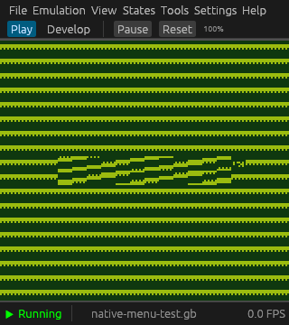
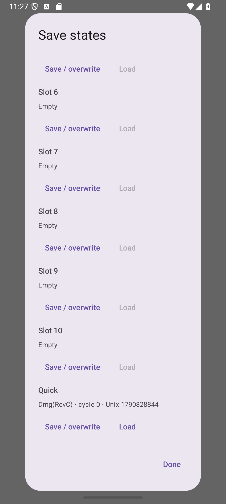

# Save states

Desktop: open **States → Save states** in either workspace, or use **F5**
(quick save), **Shift+F5** (quick load), and **Ctrl+F5 / Cmd+F5** (undo load).
Android: open the pause menu and choose **Save states**.

Desktop menus retain visible States and Help entries at the default 2x size.
Compact spacing preserves the game area; larger text or additional menus wrap
onto another row instead of clipping controls.

Each ROM has ten numbered slots, a quick slot, and a recovery slot. Saving a
slot replaces its previous contents. Import loads an external `.vstate`;
export captures the current machine. Slot metadata identifies the hardware,
capture time and CPU cycle count. Picker cancellation does not change a slot
or the running machine.

Loading restores the machine **and all cartridge SRAM**, including MBC2 RAM,
banked MBC1/3/30/5 and TPP1 SRAM. Subsequent ordinary battery-save flushes write
the restored SRAM to the cartridge's existing save path. There is no implicit
preserve-current-SRAM mode.

Before every successful load, the complete current machine/SRAM is atomically
saved to Recovery. Loading Recovery swaps it with the current state, so undo
can be repeated. Recovery persists across application restarts: reopen the
same ROM and model, then load Recovery. If validation or writing Recovery
fails, the running machine remains unchanged. Keep an export for older states
you want to retain beyond the next successful load.

Slots are keyed by SHA-256 of the full ROM bytes. Desktop stores them beside
its UI configuration under `states/`; Android keeps them within each game
instance under `states/`. Renaming a desktop ROM keeps its identity; changing
ROM bytes (including debugger ROM patches) changes it. Snapshots contain no
ROM/boot-ROM images or host save paths. Load requires the matching ROM,
hardware revision, boot-ROM configuration and SGB/hybrid mode. Unknown format
versions, damaged files and invalid hardware state are rejected.

Disconnect external link cable and Mobile Adapter endpoints before saving
or loading. Disconnected and loopback serial transfers are supported. Host
audio devices, debugger watchpoints, paths, and network resources are never
restored from a file. Frontends refresh video/audio and reconcile live input
after a load. RTC registers and their fractional emulated time are restored;
time spent with a state on disk is not added to its RTC.

## Format and maintenance

Version 1 uses `VIBESTAT`, a little-endian version, SHA-256 payload checksum,
and a bounded JSON payload (maximum 16 MiB). Fixed-array decoders enforce exact
lengths. The candidate is decoded and checked before live-machine replacement.
The core uses a bounded 16 MiB decoder-thread stack for large PPU/SGB arrays,
including Windows/JNI callers. Slot writes use same-directory temporary files,
file sync and atomic replacement; Unix additionally syncs the directory.
Android document providers control the atomicity of external exports; private
slots and Recovery always use the atomic core writer.

The serialized hardware structures are the v1 schema: changes to serialized
fields require an explicit version/migration decision. Rewind, recording,
automatic resume and preserve-current-SRAM choices are outside this feature.
The initial v1 schema includes the upstream serial master-clock phase merged
before this feature's release; snapshots from earlier experimental PR builds
are not a supported compatibility baseline.

## Verification

Automated tests cover all model revisions and supported mapper variants,
deterministic continuation, SRAM restoration and subsequent battery flushes,
durable/repeated undo, SGB/hybrid borders, pending hardware events, incompatible
ROM/model/boot configuration, malformed data, external sessions, and failed
recovery/atomic writes. Desktop-worker and Android-bridge tests exercise
repeated operations and failure reporting. Android instrumentation exercises
the visible quick-save/load/undo/reopen flow. The eight-test Android suite passed
on an Android 16 / API 36 x86_64 emulator using a cold boot and software rendering;
the first hardware-rendered run aborted in Android system graphics during an
existing navigation test, before the save-state test ran.

Additional regressions cover metadata browsing, import/export replacement,
oversized files and captures, reserved slots, malformed fixed arrays, and
checksummed invalid APU sample phases. A phase at or above the model clock is
rejected before changing the running machine, SRAM, or Recovery; the largest
valid phase still resumes through the live audio queue.

Menu tests resize a live egui context between 320, 360, 480, 640 and 1100 points,
with 1x/1.5x/2x text and Debug present/absent, and repeatedly open States and
Help. Normal Play mode keeps a single menu row. Native Windows/OpenGL rendering
was captured at the default 2x size (320x360 client area, 320x288 game area)
using a generated test ROM and an isolated configuration. The eframe capture
helper was temporarily delayed to a settled frame; application code and the
committed dependencies were unchanged by the capture harness.

Final command results and CI status are recorded in the pull request. Remaining
manual verification:

- Further native Windows/macOS/Linux window and picker interactions, including cancelled
  imports/exports and closing/reopening the state browser during operations.
- Android physical-device lifecycle, process death, rotation during a picker or
  state operation, TV/controller navigation, and document-provider failures.
- Power-loss durability on the user's actual filesystem/storage hardware.
